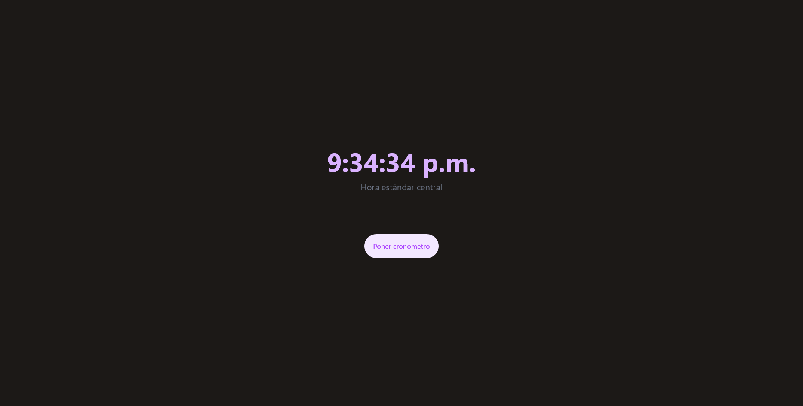

# Reloj Personal

Proyecto creando un reloj con la hora actual y un temporizador. Asentando las bases de React utilizando Hooks de useState y useEffect.

## 📸 Captura de Pantalla

## 🌐 Enlace al sitio

- [https://personal-clock.vercel.app/](https://personal-clock.vercel.app/)

## 🛠️ Tecnologías utilizadas

- React.js
- TailwindCSS

## 👨‍💻 Autor

- GitHub - [GuidoPerezR](https://github.com/GuidoPerezR)
- X - [@GU1DZ3RO](https://x.com/GU1DZ3RO)
